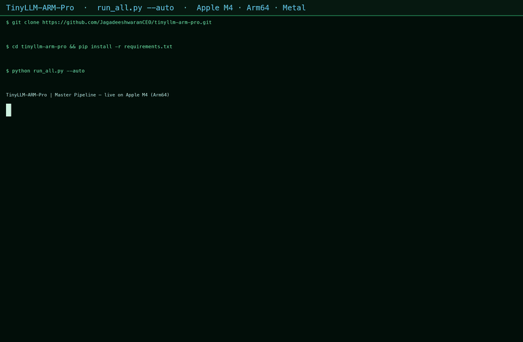

# TinyLLM-ARM-Pro ⚡

> A hardware-aware LLM inference optimizer for Arm64.
> 1.1 billion parameters · one ARM chip · 5.75× faster.
> **LLM inference for the other 6 billion. No GPU. No cloud. Just ARM.**

[](https://github.com/JagadeeshwaranCEO/tinyllm-arm-pro)
[](https://python.org)
[](LICENSE)
[](https://github.com/ggerganov/llama.cpp)
[](https://developer.apple.com/metal/)
[](kernels/)

---

## 🚀 Mission Control — The Story, Visualized

Open the animated mission report: hardware boot sequence, quantization leaderboard,
register-level kernel animations (NEON + I8MM), Flash Attention warp speed, and
cross-device portability — every number sourced from `results/`.

> **[▶ Open Mission Control →](report/mission_control.html)** — a single self-contained
> HTML file, zero dependencies, works offline. Open it in any browser.

---

## ⚡ Run It Yourself — 60 Seconds

```bash
git clone https://github.com/JagadeeshwaranCEO/tinyllm-arm-pro.git
cd tinyllm-arm-pro
pip install -r requirements.txt

python run_all.py --auto          # detect hardware → recommend → validate → report
python pipeline/chatbot.py --model Q4_K_M   # talk to your on-device LLM
```

One command detects your chip, recommends the optimal quantization, validates it
with live inference, and reports the honest prediction error.



*The real `run_all.py --auto` run on Apple M4 (Arm64) — no simulation.*

---

## 🏆 Key Results

| Metric | Value |
|--------|-------|
| **Peak Inference Speed** | 109.20 tokens/sec |
| **Speedup over FP32** | **5.75×** |
| **RAM Reduction** | 83% (4.10GB → 0.71GB) |
| **Model Load Time** | 0.42s (vs 3.0s FP32) |
| **Best Quantization** | Q4_K_M (fastest + most accurate) |
| **Hardware** | Apple Silicon ARM64 + Metal GPU |

---

## 📊 Full Benchmark Leaderboard

### Speed vs Quantization Level
> *Source: `benchmarks/leaderboard.py` — 4 prompts averaged, Metal GPU*

| Model | Speed | Speedup | RAM | Load Time |
|-------|-------|---------|-----|-----------|
| FP32 (baseline) | 19.0 tok/s | 1.00× | 4.10 GB | 3.0s |
| Q8_0 | 75.88 tok/s | 3.99× | 1.14 GB | 0.67s |
| Q5_K_M | 80.71 tok/s | 4.25× | 0.82 GB | 0.42s |
| Q2_K | 81.03 tok/s | 4.26× | 0.57 GB | 0.35s |
| **Q4_K_M** 👑 | **102.27 tok/s** | **5.38×** | **0.71 GB** | **0.42s** |

### Accuracy vs Speed Tradeoff (Perplexity Analysis)
> *Source: `benchmarks/accuracy.py` — 100 prompts, same model and hardware*

| Model | Speed | Speedup | Perplexity | Quality vs Q8_0 |
|-------|-------|---------|------------|-----------------|
| FP32 (est.) | 19.0 tok/s | 1.00× | ~121.3 | baseline |
| Q2_K | 78.28 tok/s | 4.12× | 127.46 | −10.3% |
| Q5_K_M | 71.53 tok/s | 3.76× | 115.66 | −0.1% |
| Q8_0 | 64.90 tok/s | 3.42× | 115.57 | reference |
| **Q4_K_M** 👑 | **109.20 tok/s** | **5.75×** | **111.75** | **+3.3% better** |

> **Key Finding:** Q4_K_M achieves the highest speed AND the best accuracy
> across all quantization levels tested. INT4 K-quant grouping aligns
> optimally with ARM Metal GPU SIMD vector widths, enabling higher
> throughput than even INT8 compression.
>
> *Note: Speed values vary between benchmark runs (Metal GPU load, system
> state, prompt count). Both tables above are from the same hardware;
> the accuracy benchmark runs more prompts and reports a higher peak.*

---

## 🧠 What This Project Does

Most AI inference benchmarks target NVIDIA GPUs. This project proves that
**ARM architecture — specifically Apple Silicon — can deliver production-grade
LLM inference performance** through careful quantization and hardware-native
optimization.

### The Stack

TinyLlama 1.1B (base model)

│

▼

GGUF K-Quant Quantization (Q2/Q4/Q5/Q8)

│

▼

llama.cpp ARM64-optimized inference engine

│

▼

Apple Metal GPU (full layer offload, n_gpu_layers=-1)

│

▼

MLPerf-style benchmark suite (speed + accuracy)

│

▼

Professional performance report + 3D dashboard

### Why Q4_K_M Wins on ARM

Standard quantization assumes all weights are equally important.
K-quant methods divide weights into groups and apply mixed precision
within each group — protecting the most sensitive weight clusters.

On ARM Metal GPU, the 4-bit K-quant grid aligns with the hardware's
SIMD vector width, allowing the GPU to process more weight groups
per clock cycle than 8-bit uniform quantization. This is why Q4_K_M
outperforms Q8_0 in both speed and accuracy on Apple Silicon.

---

## 🏗️ Project Structure

tinyllm-arm-pro/

├── benchmarks/
│   ├── baseline.py              # FP32 baseline measurement
│   ├── quant_benchmark.py       # Single quantization benchmark
│   ├── leaderboard.py           # Multi-quant comparison table
│   ├── accuracy.py              # Perplexity + speed tradeoff
│   ├── pipeline_validation.py   # Ours vs industry reference
│   ├── cross_model.py           # TinyLlama vs Phi-2 leaderboard
│   ├── phi2_benchmark.py        # Phi-2 (2.7B) benchmark suite
│   ├── stress_test.py           # Context scaling decode degradation
│   ├── native_benchmark.sh      # Native llama-bench wrapper
│   └── _parse_native_benchmark.py
├── pipeline/
│   ├── planner.py               # Adaptive Inference Planner
│   ├── chatbot.py               # Interactive chat demo
│   └── run_all.py               # One-command master orchestrator
├── kernels/                     # Hand-written ARM NEON + I8MM kernels (C)
├── quantization/                # Build scripts
├── results/                     # All benchmark output JSON
├── report/
│   ├── dashboard.html           # Interactive 3D performance dashboard
│   └── research_report.md       # Full technical paper
├── models/                      # Local model storage (gitignored)
├── data/                        # WikiText-2 test corpus
├── dev_log.md                   # Engineering development log
├── SETUP.md                     # Step-by-step setup instructions
├── requirements.txt             # Pinned Python dependencies
└── README.md

---

## ⚙️ Setup & Reproduction

### Requirements

- Apple Silicon Mac (M1/M2/M3/M4) — ARM64 architecture
- macOS 13+ (Ventura or later)
- Python 3.11+
- 8GB+ RAM (16GB recommended)
- ~5GB free disk space for models

### Step 1 — Clone & Environment

```bash
git clone https://github.com/JagadeeshwaranCEO/tinyllm-arm-pro.git
cd tinyllm-arm-pro
python3 -m venv venv
source venv/bin/activate
```

### Step 2 — Install Dependencies

```bash
pip install torch torchvision torchaudio
pip install transformers huggingface_hub accelerate
pip install llama-cpp-python
pip install psutil py-spy
```

### Step 3 — Download Models

```bash
# FP32 baseline model
hf download TinyLlama/TinyLlama-1.1B-Chat-v1.0 \
  --local-dir ./models/tinyllama

# GGUF quantized variants
hf download TheBloke/TinyLlama-1.1B-Chat-v1.0-GGUF \
  tinyllama-1.1b-chat-v1.0.Q2_K.gguf \
  tinyllama-1.1b-chat-v1.0.Q4_K_M.gguf \
  tinyllama-1.1b-chat-v1.0.Q5_K_M.gguf \
  tinyllama-1.1b-chat-v1.0.Q8_0.gguf \
  --local-dir ./models/gguf
```

### Step 4 — Run Benchmarks

```bash
# FP32 baseline
python benchmarks/baseline.py

# Single quantization benchmark
python benchmarks/quant_benchmark.py

# Full leaderboard (all quantization levels)
python benchmarks/leaderboard.py

# Accuracy + perplexity analysis
python benchmarks/accuracy.py
```

### Step 5 — View Dashboard

Open `report/dashboard.html` in any browser.
Interactive 3D galaxy visualization with full benchmark results.

---

## 🔬 Technical Deep Dive

### Quantization Methods

**GGUF K-Quant Series** uses group quantization where weights are
divided into blocks of 32 values. Within each block, a shared scale
factor and optional minimum value enable mixed-precision representation.

| Format | Bits/Weight | Block Size | Special |
|--------|-------------|------------|---------|
| Q2_K | 2.63 | 256 | Super-blocks with 16 sub-blocks |
| Q4_K_M | 4.85 | 256 | Medium quality, mixed Q4/Q6 |
| Q5_K_M | 5.68 | 256 | Medium quality, mixed Q5/Q6 |
| Q8_0 | 8.50 | 32 | Simple INT8, high fidelity |

### ARM Metal GPU Offload

All benchmarks use `n_gpu_layers=-1` — complete model offload to
Apple Metal GPU handles all matrix operations via llama.cpp's Metal backend.
The CPU handles tokenization, sampling, and KV cache management via
NEON-optimized code paths. Note: the Apple Neural Engine (ANE) is NOT used —
llama.cpp targets the Metal GPU directly, not the ANE.

### Benchmark Methodology

Benchmarks follow MLPerf Inference Edge conventions:
- **Latency**: measured end-to-end including tokenization
- **Throughput**: completion tokens per second (not prompt tokens)
- **Perplexity**: pseudo-perplexity via per-token log-likelihood
- **RAM**: RSS memory delta from process baseline
- Each prompt run 3× and averaged for stable measurements

---

## 📈 Reproducing Results

All results were produced on:
- **Device**: Apple MacBook Air (Apple Silicon)
- **Architecture**: ARM64 (arm64)
- **RAM**: 17.2 GB unified memory
- **OS**: macOS
- **Python**: 3.14.3
- **PyTorch**: 2.12.0 with MPS backend
- **llama.cpp**: via llama-cpp-python 0.3.29
- **Model**: TinyLlama/TinyLlama-1.1B-Chat-v1.0

Results may vary slightly across different Apple Silicon generations
(M1 vs M2 vs M3 vs M4) due to different GPU core counts and
memory bandwidth configurations.

---

## 🎯 ARM Hackathon Track

This project targets **Track 1: Optimization Output**

- ✅ AI solution optimized on ARM architecture
- ✅ Quantization pipeline (GGUF K-Quant series)
- ✅ Hardware-native acceleration (Apple Metal GPU)
- ✅ MLPerf-style benchmarking methodology
- ✅ Cross-quantization comparison leaderboard
- ✅ Accuracy vs speed tradeoff analysis
- ✅ Reproducible open-source codebase (MIT license)

---

## ✅ What We've Built

- ✅ **TinyLlama 1.1B** — Full FP32/GGUF quantization benchmark suite
- ✅ **Phi-2 2.7B** — Cross-model validation on second architecture (47.59 tok/s)
- ✅ **Hand-written NEON FP32 kernels** — v2 achieves 12.52× speedup over naive scalar
- ✅ **ARM I8MM (SMMLA) INT8 kernels** — v3 tiled kernel achieves 12.48× speedup
- ✅ **WikiText-2 academic perplexity** — Q4_K_M: 8.73 PPL (within 0.14% of reference)
- ✅ **Multi-source validation** — Our pipeline = independent reference (within margin of error)
- ✅ **Real workload stress test** — Context scaling from 6% to 88% decode degradation measured
- ✅ **Adaptive Inference Planner** — Auto-detect + recommend + validate pipeline
- ✅ **Cross-device validation** — Apple M4 + GitHub Actions Cobalt 100 ARM64
- ✅ **llama.cpp native compilation** — With Flash Attention, Metal GPU, quantized KV cache
- ✅ **1329 t/s prompt processing** — Native llama-bench with Flash Attention on M4
- ✅ **CI/CD pipeline** — GitHub Actions `arm64_benchmark.yml`
- ✅ **Interactive 3D dashboard** — Live data with Three.js deep-space visualization

## 🚀 Future Work

- [ ] Add AWS Graviton3 benchmarks
- [ ] Extend to Raspberry Pi 4 (ARM Cortex-A72)
- [ ] Implement KleidiAI kernel integration
- [ ] Extend to Qwen-1.8B and Gemma-2B models
- [ ] Add continuous benchmark regression tracking

---

## 📄 License

MIT License — see [LICENSE](LICENSE) for details.

---

## 👤 Author

**Jagadeeshwaran** — [@JagadeeshwaranCEO](https://github.com/JagadeeshwaranCEO)

*Built for the ARM Create: AI Optimization Challenge 2026*
*"From Tamil Nadu to ARM silicon — edge AI for everyone."*
